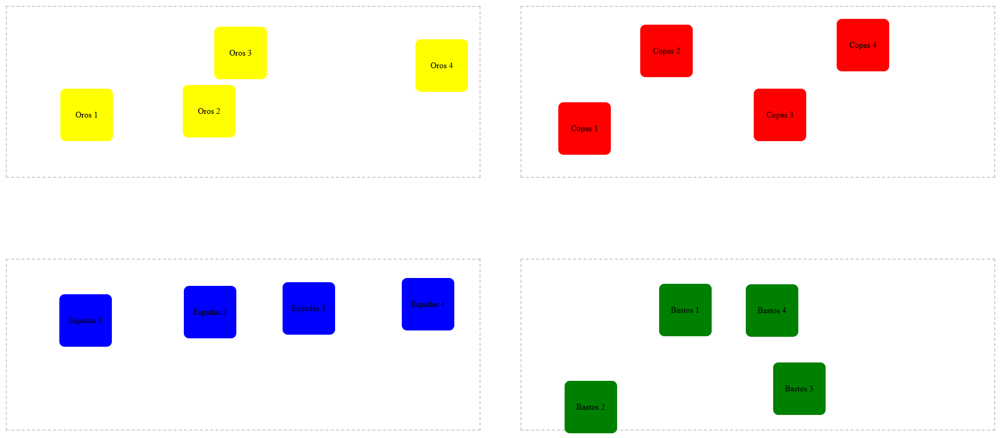

# Aplicación de Arrastrar y Soltar Cartas

## Descripción

Esta es una aplicación web que permite arrastrar y soltar cartas dentro de contenedores específicos. Cada contenedor representa un palo de la baraja española (Oros, Copas, Espadas y Bastos) y está asociado a un color particular. Las cartas solo pueden ser colocadas en el contenedor que coincide con su color y palo. Además, la posición de las cartas se guarda en el servidor, de modo que al recargar la página, las cartas mantienen su última posición.

## Estructura del Proyecto

.
├── .gitattributes
├── readme.md
├── client
│ ├── css
│ │ └── styles.css
│ ├── index.html
│ └── js
│ ├── card.js
│ ├── deck.js
│ ├── index.js
│ └── uiDrag.js
└── server
├── index.js
└── package.json

## Funcionalidades Principales

- **Arrastrar y Soltar**: Permite arrastrar cartas y soltarlas dentro de su contenedor correspondiente.
- **Restricción por Color y Palo**: Las cartas solo pueden ser movidas dentro del contenedor que coincide con su color y palo.
- **Guardado de Posición**: La posición de cada carta se guarda en el servidor mediante una API REST, permitiendo que al recargar la página las cartas permanezcan en su última ubicación.
- **Manejo de Errores**: Maneja errores en la comunicación con la API y movimientos inválidos, informando al usuario adecuadamente.
- **Interfaz Mejorada**: La interfaz ha sido actualizada para distribuir los contenedores de forma responsiva, ocupando el 48% del ancho de la pantalla y ubicándolos en las esquinas con separación adecuada.

## Cambios Realizados

### Estado Inicial del Proyecto

Al inicio, el proyecto consistía en una aplicación básica que permitía arrastrar y soltar cartas, pero no conservaba la posición de las mismas al recargar la página. Además no manejaba errores de manera efectiva y he bloqueado las demas cartas minetras que una se este moviendo.

### Cambios y Funcionalidades Agregadas

1. **Implementación de la API REST**:

   - **Servidor**: Se creó un servidor con Node.js y Express en el archivo [`server/index.js`](server/index.js) que expone endpoints para obtener y actualizar el estado de las cartas.
   - **Dependencias**: Se agregaron las dependencias `express` y `cors` en [`package.json`](server/package.json).
   - **Manejo de Datos**: Se implementó un objeto en el servidor para almacenar el estado de las cartas.

2. **Guardado y Recuperación de la Posición de las Cartas**:

   - **Actualización de `uiDrag.js`**: Se modificó el archivo [`client/js/uiDrag.js`](client/js/uiDrag.js) para enviar las actualizaciones de posición de las cartas al servidor mediante una petición POST a la API REST.
   - **Actualización de `index.js`**: Se actualizó el archivo [`client/js/index.js`](client/js/index.js) para recuperar el estado de las cartas desde el servidor al cargar la página.
   - **Modificación de `deck.js` y `card.js`**: Se adaptaron estos archivos para manejar la posición de las cartas al crearlas y renderizarlas.

3. **Manejo de Errores Mejorado**:

   - **Bloques `try...catch`**: Se agregaron bloques `try...catch` en los archivos [`index.js`](client/js/index.js) y [`uiDrag.js`](client/js/uiDrag.js) para manejar errores en la comunicación con la API.
   - **Mensajes al Usuario**: Se implementaron alertas para informar al usuario en caso de errores.

4. **Restricción para Mover Solo una Carta a la Vez**:

   - **Deshabilitar Arrastre de Otras Cartas**: En [`uiDrag.js`](client/js/uiDrag.js), se agregó lógica para deshabilitar el arrastre de otras cartas cuando una está siendo arrastrada.
   - **Rehabilitar Arrastre**: Al soltar la carta, se rehabilita el arrastre de las demás cartas.

5. **Interfaz de Usuario Mejorada**:

   - **Estilos CSS Actualizados**: Se modificó el archivo [`styles.css`](client/css/styles.css) para mejorar la distribución de los contenedores y cartas.
   - **Distribución Responsiva**: Ahora, cada contenedor ocupa el 48% del ancho de la pantalla y se ubica en una esquina, manteniendo separación entre ellos.

6. **Comentarios y Documentación del Código**:

   - **Comentarios Detallados**: Se agregaron comentarios explicativos en todos los archivos JavaScript para facilitar la comprensión del código.
   - **Estandarización**: Se siguió una estructura consistente para los comentarios y la documentación.

7. **Validaciones Adicionales**:

   - **Restricción por Color**: Se añadió lógica para verificar que las cartas solo puedan ser soltadas en contenedores que coincidan con su color.
   - **Control de Errores en el Servidor**: Se mejoró el manejo de errores en el servidor para responder adecuadamente ante solicitudes inválidas.

## Cómo Ejecutar el Proyecto

### Prerrequisitos

- **Node.js**: Asegúrate de tener Node.js instalado en tu sistema.

### Pasos

1. **Clonar el Repositorio**:

   git clone ismaelManz26

   **Instalar Dependencias del Servidor**:

   cd server
   npm install

   **Iniciar el Servidor**:

   node index.js

   **Abrir el Cliente**:

   Navega a la carpeta client y abre el archivo index.html en tu navegador web.
